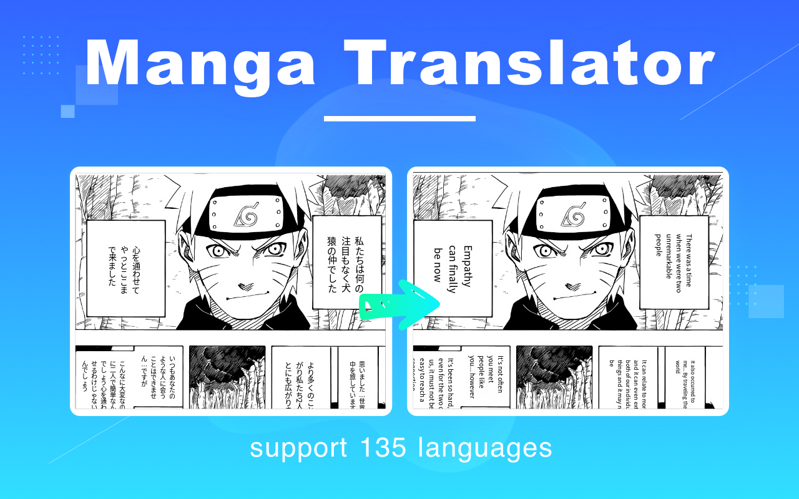
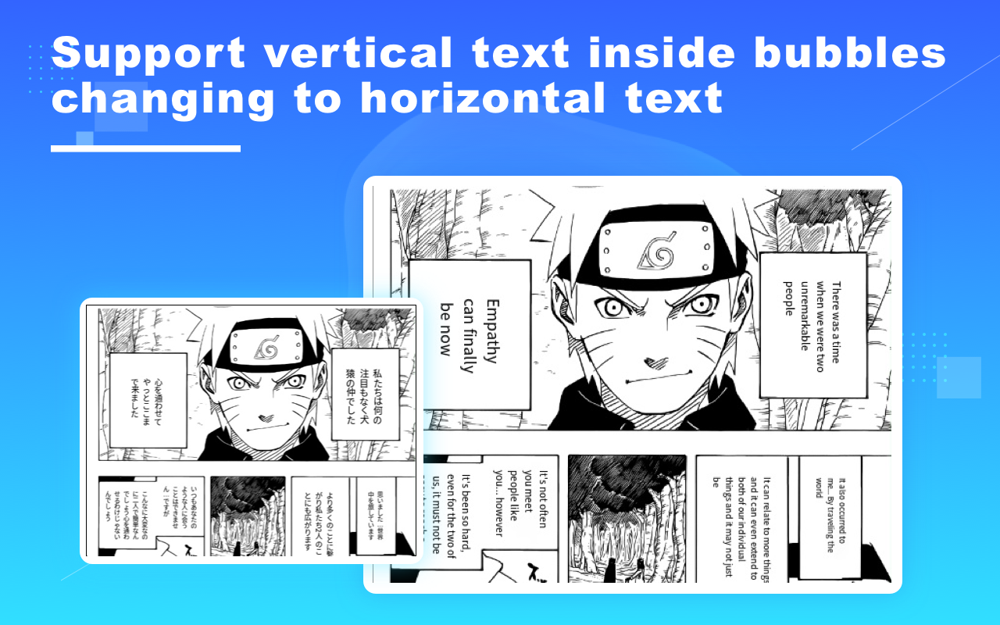
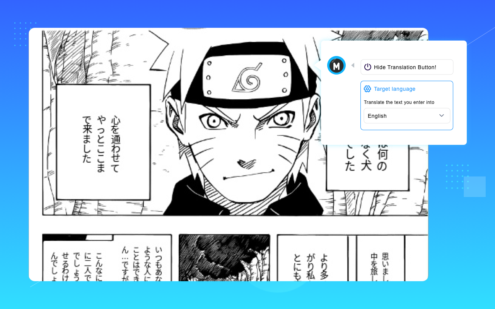
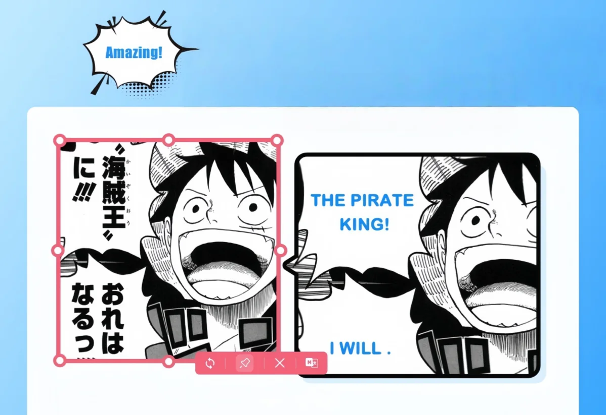
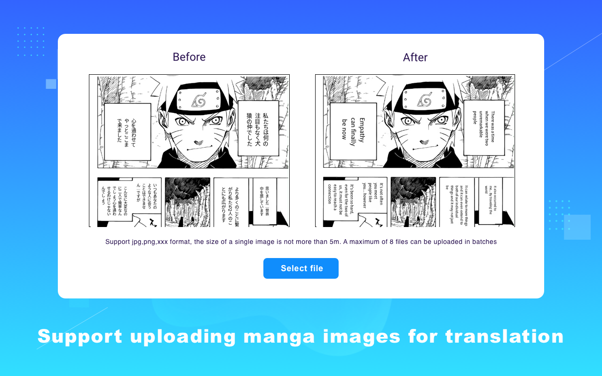
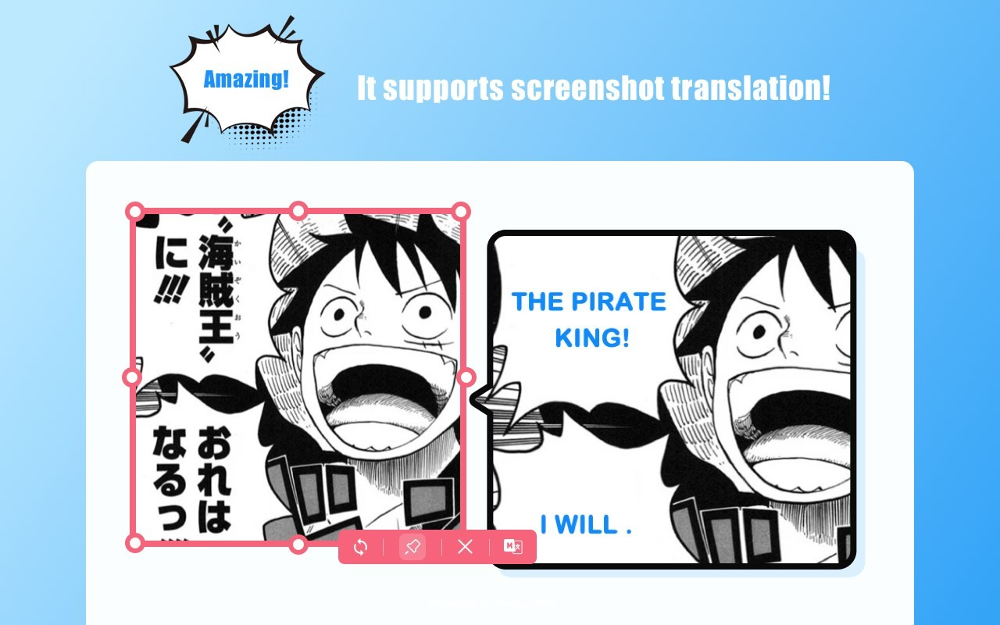
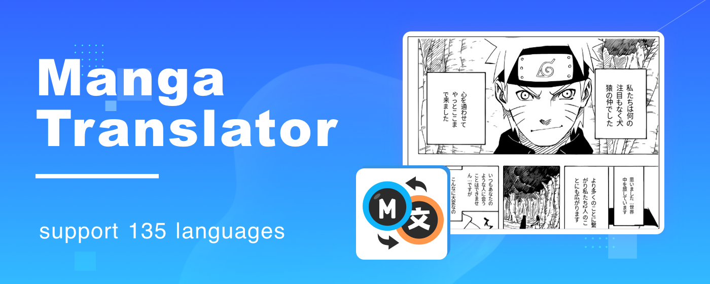

# translateManga Manga Translator - User Guide

## 📚 Table of Contents

- [🌟 Project Introduction](#project-introduction)
- [🔍 Technical Principles](#technical-principles)
- [✨ Features](#features)
- [🚀 Usage Guide](#usage-guide)
- [🌎 Regional Adaptation](#regional-adaptation)
- [📊 Case Studies](#case-studies)
- [❓ Frequently Asked Questions](#frequently-asked-questions)

## 🌟 Project Introduction

**translateManga** is an advanced AI-powered manga content translation tool that can intelligently recognize text in manga, providing high-quality multilingual translations while perfectly preserving the original manga's artistic style and layout. Whether it's Japanese manga, Korean manhwa, or Western comics, you can easily enjoy a cross-language reading experience.

Official Website: [https://translatemanga.online](https://translatemanga.online)

### Core Advantages

- **Intelligent Recognition**: Advanced OCR technology accurately identifies manga text in various fonts and layouts
- **Precise Translation**: Context-aware translation based on the latest large language models (GPT-4, Claude, etc.)
- **Layout Preservation**: Translated text perfectly integrates into the original speech bubbles and layout
- **Multilingual Support**: Supports translation between 100+ languages
- **Batch Processing**: Supports batch translation of entire manga volumes

## 🔍 Technical Principles

### AI-Driven Translation Engine

This tool employs cutting-edge neural network translation systems that not only understand word meanings but also capture contextual nuances, ensuring natural and fluent translation results. The system first "reads" the entire manga, grasping the overall style and character traits, then produces cohesive and consistent translations.

### OCR Text Recognition Technology

To address the unique layout challenges in manga, we've developed a specialized Comic Text Detector that can precisely identify:

- Vertical and horizontal text
- Handwritten-style fonts
- Special effect fonts and onomatopoeia
- Small background text and annotations
- Decorated speech bubbles

The recognition accuracy reaches an industry-leading 99%, accurately extracting text even in complex backgrounds.

### Layout Preservation Mechanism

After translation, the system intelligently adjusts font size, line spacing, and layout to ensure the translated text perfectly integrates into the original bubbles and layout. Key technologies include:

1. **Intelligent Typesetting Algorithm**: Automatically adjusts font size and line spacing based on target language text length
2. **Background Restoration Technology**: Intelligently restores the background after removing the original text
3. **Style Matching**: Maintains consistent font style and expressiveness with the original manga

## ✨ Features

### Batch Translation

Supports batch processing of entire manga volumes or multiple pages, allowing uploads of up to 300MB of PDFs or image collections. The system automatically processes each page and generates a complete translated version.

### Real-time Translation

Through browser extensions, achieve real-time translation of web manga. When browsing supported manga websites, the extension automatically detects and translates manga content on the page without needing to download the original images.

Supported websites include:
- MangaDex
- MangaFire
- ManhuaRen
- WebToonScan
- And 100+ other manga websites

### Multilingual Support

Comprehensive support for translation between the following languages:

- European languages such as English, French, German, Spanish, etc.
- Asian languages such as Chinese (Simplified/Traditional), Japanese, Korean, etc.
- RTL writing systems such as Arabic and Hebrew
- Slavic languages such as Russian and Polish

The system automatically adjusts the text layout and direction based on the characteristics of different languages.

### Screenshot Translation Feature

For physical manga books or websites that don't support automatic translation, we provide a powerful screenshot translation feature:

1. Click the screenshot button in the extension
2. Select the manga area you want to translate
3. The system automatically recognizes and translates the text
4. Translation results are displayed directly on the original image

### Terminology Customization

For specific manga works, you can create dedicated terminology glossaries to ensure consistency in the translation of character names, special ability names, and other proper nouns. This is particularly important for long-running series or manga franchises.

## 🚀 Usage Guide

### Quick Start - Three Steps to Translate Manga

#### Step 1: Upload Manga
1. Visit the manga translation platform [https://translatemanga.online](https://translatemanga.online)
2. Click the "Upload" button
3. Select manga files (supported formats include JPG, PNG, PDF, etc.)

#### Step 2: Select Language and Settings
1. Choose the source language of the manga
2. Select the target translation language
3. Adjust translation settings (optional):
   - Font style
   - Text recognition mode
   - Terminology glossary settings

#### Step 3: Get Translation Results
1. Click the "Start Translation" button
2. Wait for the translation process to complete (approximately 1-2 minutes)
3. Preview and download the translated manga

### Advanced Usage Tips

#### Browser Extension Usage

1. Visit the official website to download and install the browser extension: [https://translatemanga.online](https://translatemanga.online)
2. Supported browsers include Chrome, Firefox, and Edge:
     
3. Select the default translation language in the extension settings
4. When browsing supported manga websites, click the extension icon to activate translation
5. Use the screenshot translation feature to translate any manga panel

#### Processing Large Manga Volumes

1. Save the entire manga as PDF or package it as ZIP/CBZ file
2. Upload to the batch processing page
3. Set global translation parameters
4. Start batch translation; processing time depends on the number of pages
5. Download the complete translated version or read online

#### Reading Progress Tracking

To provide a more complete manga reading experience, the translateManga extension also offers cross-platform reading progress tracking:

1. Enable the reading progress synchronization feature
2. The system records the manga chapters you read across different websites
3. Continue where you left off when logging in from any device
4. Support for custom categorization and favorites

#### Translation Quality Optimization

1. **Create Terminology Glossaries**: Add translation pairs for proper nouns in specific manga
2. **Adjust Recognition Sensitivity**: Fine-tune text detection parameters for manga with special fonts
3. **Manual Editing**: The system supports manual correction and refinement after translation

## 🌎 Regional Adaptation

### Western Market Special Features

For Western manga readers' reading habits, translateManga provides the following special features:

1. **Left-to-Right Reading Mode**: Automatically adjusts Japanese and Korean manga reading direction to adapt to Western reading habits
2. **Western Font Optimization**: Provides various Western comic-style fonts to maintain artistic consistency after translation
3. **Slang and Cultural Reference Localization**: Intelligently converts culture-specific expressions to make translations more relevant to the target audience

### Multi-platform Support

To accommodate users' habits in different regions, translateManga offers various usage options:

1. **Web Application**: Use directly through the browser without installation
2. **Browser Extensions**: Support for mainstream browsers including Chrome, Firefox, and Edge
3. **Mobile Applications**: Dedicated applications for iOS and Android platforms, supporting offline translation
4. **Desktop Software**: Professional versions for Windows and macOS systems, providing more powerful batch processing capabilities

### Localization Support

For the special needs of different regions, translateManga provides the following localization support:

1. **Interface Languages**: Interface localization in 14 major languages
2. **Customer Service**: Multilingual customer support and localized help documentation
3. **Compliance**: Adherence to data protection regulations such as GDPR and CCPA in different regions

## 📊 Case Studies

### Japanese Manga Translation Case

**"SPY×FAMILY" Translation Effect**

Translation characteristics:
- Preserves the original humor
- Accurately conveys character voice and tone
- Precisely translates specialized terminology
- Localizes onomatopoeia

### Korean Manhwa (Webtoon) Translation Case

**"Tower of God" Translation Effect**

Translation characteristics:
- Perfectly maintains vertical strip layout
- Preserves special font visual effects
- Maintains terminology consistency
- Optimizes long dialogue bubble layout

### Western Comics Translation Case

**"Avengers" Translation Effect**

Translation characteristics:
- Maintains Western dialogue box layout
- Recreates sound effect artistry
- Appropriately localizes English slang
- Matches special font styles

## ❓ Frequently Asked Questions

### Translation Accuracy Related

**Q: How is translation quality assured?**
A: We use the industry's most advanced AI large models (GPT-4o, Claude, etc.) for translation, combined with manga-specific domain training to significantly improve accuracy in manga scenarios. Before translation, the system first "reads" the entire manga to understand the context, ensuring cohesive and consistent translation results.

**Q: Can it handle special cultural memes and puns?**
A: The system can identify most common cultural references and wordplay, attempting to find equivalent expressions in the target language. For highly specific cultural references, the system preserves the original meaning and adds brief explanations when necessary.

### Technical Questions

**Q: What file formats are supported?**
A: Common image formats (JPG, PNG, WEBP), manga-specific formats (CBR, CBZ), as well as PDF and EPUB e-book formats are supported, with a single file size limit of 300MB.

**Q: How does it handle extra-long manga pages?**
A: The system supports extremely long strip manga pages up to 10,000 pixels, automatically processing them in segments while maintaining overall layout consistency.

**Q: How can I save the translated files?**
A: Translation results can be saved in the original format (e.g., PDF remains as PDF), or exported as image collections or online reading links for easy sharing and cross-device reading.

## Related Links and Contact Information

- [Official Website](https://translatemanga.online)
- **Email**: support@translatemanga.online
- **Discord**: [Join our Discord Community](https://discord.gg/translatemanga)

If you have any questions or suggestions, feel free to contact us anytime!

---

*This document was last updated in June 2024* 