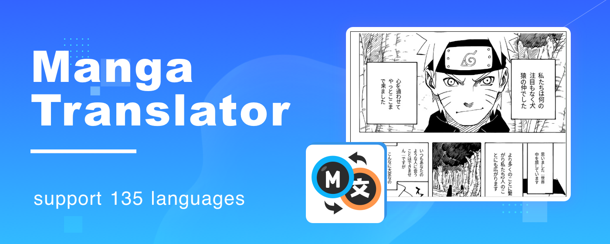

# translateManga 만화 번역기 - 사용자 가이드

*언어 선택: [English](README.md) | [繁體中文](README_TC.md) | [العربية](README_AR.md) | [Magyar](README_HU.md) | [ไทย](README_TH.md) | [한국어](README_KO.md) | [Türkçe](README_TR.md) | [Polski](README_PL.md) | [Français](README_FR.md) | [Русский](README_RU.md) | [Español](README_ES.md)*

## 📚 목차

- [🌟 프로젝트 소개](#프로젝트-소개)
- [🔍 기술 원리](#기술-원리)
- [✨ 기능](#기능)
- [🚀 사용 가이드](#사용-가이드)
- [🌎 지역 적응](#지역-적응)
- [📊 사례 연구](#사례-연구)
- [❓ 자주 묻는 질문](#자주-묻는-질문)

## 🌟 프로젝트 소개

**translateManga**는 만화 내 텍스트를 지능적으로 인식하고, 원래 만화의 예술적 스타일과 레이아웃을 완벽하게 보존하면서 고품질 다국어 번역을 제공하는 고급 AI 기반 만화 콘텐츠 번역 도구입니다. 일본 만화, 한국 만화, 또는 서양 만화든 상관없이 여러 언어 간의 읽기 경험을 쉽게 즐길 수 있습니다.

공식 웹사이트: [https://translatemanga.online](https://translatemanga.online)

### 핵심 장점

- **지능형 인식**: 고급 OCR 기술로 다양한 글꼴과 레이아웃의 만화 텍스트를 정확히 식별
- **정확한 번역**: 최신 대형 언어 모델(GPT-4, Claude 등)을 기반으로 한 맥락 인식 번역
- **레이아웃 보존**: 번역된 텍스트가 원래 말풍선과 레이아웃에 완벽하게 통합
- **다국어 지원**: 100개 이상의 언어 간 번역 지원
- **배치 처리**: 전체 만화 볼륨의 배치 번역 지원

## 🔍 기술 원리

### AI 기반 번역 엔진

이 도구는 단어의 의미뿐만 아니라 맥락적 뉘앙스도 포착하는 최첨단 신경망 번역 시스템을 사용하여 자연스럽고 유창한 번역 결과를 보장합니다. 시스템은 먼저 만화 전체를 "읽고", 전반적인 스타일과 캐릭터 특성을 파악한 후, 일관되고 일관된 번역을 생성합니다.

### OCR 텍스트 인식 기술

만화의 독특한 레이아웃 문제를 해결하기 위해, 다음을 정확히 식별할 수 있는 특수 만화 텍스트 감지기를 개발했습니다:

- 세로 및 가로 텍스트
- 손글씨 스타일 글꼴
- 특수 효과 글꼴 및 의성어
- 작은 배경 텍스트 및 주석
- 장식된 말풍선

인식 정확도는 업계 최고 수준인 99%에 도달하여 복잡한 배경에서도 텍스트를 정확하게 추출합니다.

### 레이아웃 보존 메커니즘

번역 후, 시스템은 번역된 텍스트가 원래 말풍선과 레이아웃에 완벽하게 통합되도록 글꼴 크기, 줄 간격, 레이아웃을 지능적으로 조정합니다. 주요 기술에는 다음이 포함됩니다:

1. **지능형 조판 알고리즘**: 대상 언어 텍스트 길이에 따라 글꼴 크기와 줄 간격을 자동으로 조정
2. **배경 복원 기술**: 원본 텍스트 제거 후 배경을 지능적으로 복원
3. **스타일 매칭**: 원본 만화와 일관된 글꼴 스타일 및 표현력 유지

## ✨ 기능

### 배치 번역

전체 만화 볼륨이나 여러 페이지의 배치 처리를 지원하여 최대 300MB의 PDF 또는 이미지 컬렉션을 업로드할 수 있습니다. 시스템이 각 페이지를 자동으로 처리하여 완전한 번역 버전을 생성합니다.

### 실시간 번역

브라우저 확장 프로그램을 통해 웹 만화의 실시간 번역을 실현합니다. 지원되는 만화 웹사이트를 탐색할 때, 확장 프로그램이 원본 이미지를 다운로드할 필요 없이 자동으로 페이지의 만화 콘텐츠를 감지하고 번역합니다.

지원되는 웹사이트에는 다음이 포함됩니다:
- MangaDex
- MangaFire
- ManhuaRen
- WebToonScan
- 그리고 100개 이상의 다른 만화 웹사이트

### 다국어 지원

다음 언어 간 번역에 대한 포괄적인 지원:

- 영어, 프랑스어, 독일어, 스페인어 등의 유럽 언어
- 중국어(간체/번체), 일본어, 한국어 등의 아시아 언어
- 아랍어 및 히브리어와 같은 RTL 쓰기 시스템
- 러시아어 및 폴란드어와 같은 슬라브 언어

시스템은 다양한 언어의 특성에 따라 텍스트 레이아웃과 방향을 자동으로 조정합니다.

### 스크린샷 번역 기능

자동 번역을 지원하지 않는 실물 만화책이나 웹사이트의 경우, 강력한 스크린샷 번역 기능을 제공합니다:

1. 확장 프로그램의 스크린샷 버튼 클릭
2. 번역하고 싶은 만화 영역 선택
3. 시스템이 자동으로 텍스트를 인식하고 번역
4. 번역 결과가 원본 이미지에 직접 표시됨

### 용어 맞춤 설정

특정 만화 작품의 경우, 캐릭터 이름, 특수 능력 이름 및 기타 고유 명사의 번역에서 일관성을 보장하기 위한 전용 용어집을 만들 수 있습니다. 이것은 특히 장기 시리즈나 만화 프랜차이즈에 중요합니다.

## 🚀 사용 가이드

### 빠른 시작 - 만화 번역을 위한 세 단계

#### 1단계: 만화 업로드
1. 만화 번역 플랫폼 방문 [https://translatemanga.online](https://translatemanga.online)
2. "업로드" 버튼 클릭
3. 만화 파일 선택(JPG, PNG, PDF 등 지원 형식 포함)

#### 2단계: 언어 및 설정 선택
1. 만화의 원본 언어 선택
2. 번역 대상 언어 선택
3. 번역 설정 조정(선택 사항):
   - 글꼴 스타일
   - 텍스트 인식 모드
   - 용어집 설정

#### 3단계: 번역 결과 받기
1. "번역 시작" 버튼 클릭
2. 번역 프로세스가 완료될 때까지 대기(약 1-2분)
3. 번역된 만화 미리보기 및 다운로드

### 고급 사용 팁

#### 브라우저 확장 프로그램 사용

1. 브라우저 확장 프로그램을 다운로드하고 설치하기 위해 공식 웹사이트 방문: [https://translatemanga.online](https://translatemanga.online)
2. 지원되는 브라우저에는 Chrome, Firefox 및 Edge가 포함됩니다:
     
3. 확장 프로그램 설정에서 기본 번역 언어 선택
4. 지원되는 만화 웹사이트 탐색 시, 번역을 활성화하기 위해 확장 프로그램 아이콘 클릭
5. 모든 만화 패널을 번역하기 위해 스크린샷 번역 기능 사용

#### 대량 만화 처리

1. 전체 만화를 PDF로 저장하거나 ZIP/CBZ 파일로 패키징
2. 배치 처리 페이지에 업로드
3. 글로벌 번역 매개변수 설정
4. 배치 번역 시작; 처리 시간은 페이지 수에 따라 다름
5. 완전히 번역된 버전 다운로드 또는 온라인으로 읽기

#### 읽기 진행 상황 추적

더 완전한 만화 읽기 경험을 제공하기 위해, translateManga 확장 프로그램은 크로스 플랫폼 읽기 진행 상황 추적도 제공합니다:

1. 읽기 진행 상황 동기화 기능 활성화
2. 시스템이 다양한 웹사이트에서 읽은 만화 챕터 기록
3. 모든 장치에서 로그인할 때 마지막으로 읽은 부분에서 계속 진행
4. 사용자 지정 분류 및 즐겨찾기 지원

#### 번역 품질 최적화

1. **용어집 생성**: 특정 만화의 고유 명사에 대한 번역 쌍 추가
2. **인식 감도 조정**: 특수 글꼴이 있는 만화에 대한 텍스트 감지 매개변수 미세 조정
3. **수동 편집**: 시스템은 번역 후 수동 수정 및 개선 지원

## 🌎 지역 적응

### 서양 시장 특별 기능

서양 만화 독자들의 읽기 습관을 위해, translateManga는 다음과 같은 특별 기능을 제공합니다:

1. **왼쪽에서 오른쪽으로 읽기 모드**: 서양 읽기 습관에 맞추어 일본 및 한국 만화 읽기 방향을 자동으로 조정
2. **서양 글꼴 최적화**: 번역 후 예술적 일관성을 유지하기 위한 다양한 서양 만화 스타일 글꼴 제공
3. **슬랭 및 문화 참조 현지화**: 번역이 대상 청중에게 더 관련성 있게 만들기 위해 문화별 표현을 지능적으로 변환

### 멀티플랫폼 지원

다양한 지역의 사용자 습관을 수용하기 위해, translateManga는 다양한 사용 옵션을 제공합니다:

1. **웹 애플리케이션**: 설치 없이 브라우저를 통해 직접 사용
2. **브라우저 확장 프로그램**: Chrome, Firefox 및 Edge를 포함한 주요 브라우저 지원
3. **모바일 애플리케이션**: iOS 및 Android 플랫폼을 위한 전용 애플리케이션, 오프라인 번역 지원
4. **데스크톱 소프트웨어**: Windows 및 macOS 시스템을 위한 전문 버전, 더 강력한 배치 처리 기능 제공

### 현지화 지원

다양한 지역의 특별한 요구 사항을 위해, translateManga는 다음과 같은 현지화 지원을 제공합니다:

1. **인터페이스 언어**: 14개 주요 언어로 인터페이스 현지화
2. **고객 서비스**: 다국어 고객 지원 및 현지화된 도움말 문서
3. **규정 준수**: 다양한 지역에서 GDPR 및 CCPA와 같은 데이터 보호 규정 준수

## 📊 사례 연구

### 일본 만화 번역 사례

**"SPY×FAMILY" 번역 효과**

번역 특성:
- 원래 유머 보존
- 캐릭터 목소리와 톤 정확하게 전달
- 전문 용어 정확하게 번역
- 의성어 현지화

### 한국 만화(웹툰) 번역 사례

**"신의 탑" 번역 효과**

번역 특성:
- 세로 스트립 레이아웃 완벽하게 유지
- 특수 글꼴 시각 효과 보존
- 용어 일관성 유지
- 긴 대화 말풍선 레이아웃 최적화

### 서양 만화 번역 사례

**"어벤저스" 번역 효과**

번역 특성:
- 서양 대화 상자 레이아웃 유지
- 사운드 이펙트의 예술적 표현 재현
- 영어 슬랭 적절하게 현지화
- 특수 글꼴 스타일 일치

## ❓ 자주 묻는 질문

### 번역 정확도 관련

**Q: 번역 품질은 어떻게 보장되나요?**
A: 만화 시나리오에서 정확도를 크게 향상시키기 위해 만화별 도메인 훈련과 결합된 업계 최첨단 AI 대형 모델(GPT-4o, Claude 등)을 번역에 사용합니다. 번역 전에 시스템은 먼저 전체 만화를 "읽어" 맥락을 이해함으로써 응집력 있고 일관된 번역 결과를 보장합니다.

**Q: 특별한 문화 밈과 말장난을 처리할 수 있나요?**
A: 시스템은 대부분의 일반적인 문화 참조와 언어 유희를 식별하여 대상 언어에서 동등한 표현을 찾으려고 시도합니다. 매우 특정한 문화 참조의 경우, 시스템은 원래 의미를 보존하고 필요한 경우 간략한 설명을 추가합니다.

### 기술 질문

**Q: 어떤 파일 형식이 지원되나요?**
A: 일반 이미지 형식(JPG, PNG, WEBP), 만화 특정 형식(CBR, CBZ), 그리고 PDF 및 EPUB 전자책 형식이 지원되며, 단일 파일 크기 제한은 300MB입니다.

**Q: 매우 긴 만화 페이지는 어떻게 처리하나요?**
A: 시스템은 최대 10,000픽셀 길이의 매우 긴 스트립 만화 페이지를 지원하며, 전반적인 레이아웃 일관성을 유지하면서 자동으로 세그먼트로 처리합니다.

**Q: 번역된 파일을 어떻게 저장할 수 있나요?**
A: 번역 결과는 원본 형식(예: PDF는 PDF로 유지)으로 저장하거나, 이미지 컬렉션 또는 온라인 읽기 링크로 내보내어 쉽게 공유하고 다양한 장치에서 읽을 수 있습니다.

## 관련 링크 및 연락처 정보

- [공식 웹사이트](https://translatemanga.online)
- **이메일**: support@translatemanga.online
- **Discord**: [Discord 커뮤니티에 가입하세요](https://discord.gg/translatemanga)

질문이나 제안 사항이 있으시면 언제든지 연락해 주세요!

---

*이 문서는 2024년 6월에 마지막으로 업데이트되었습니다* 