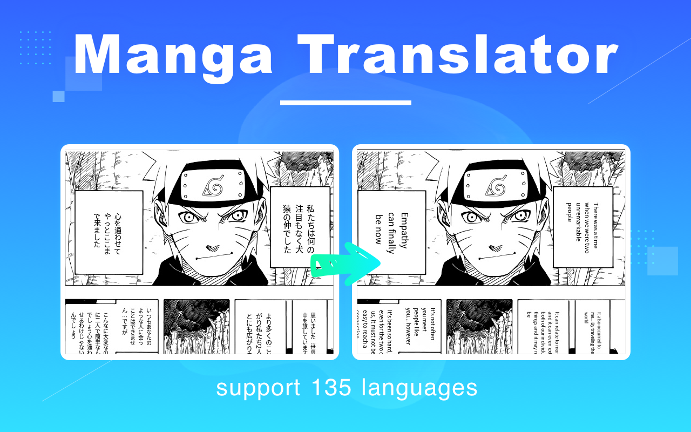
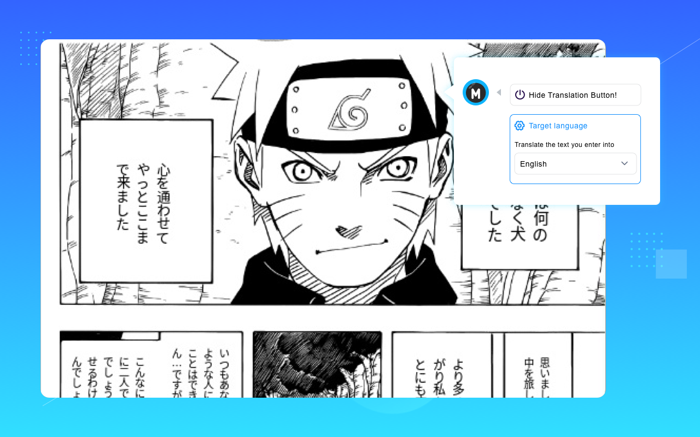
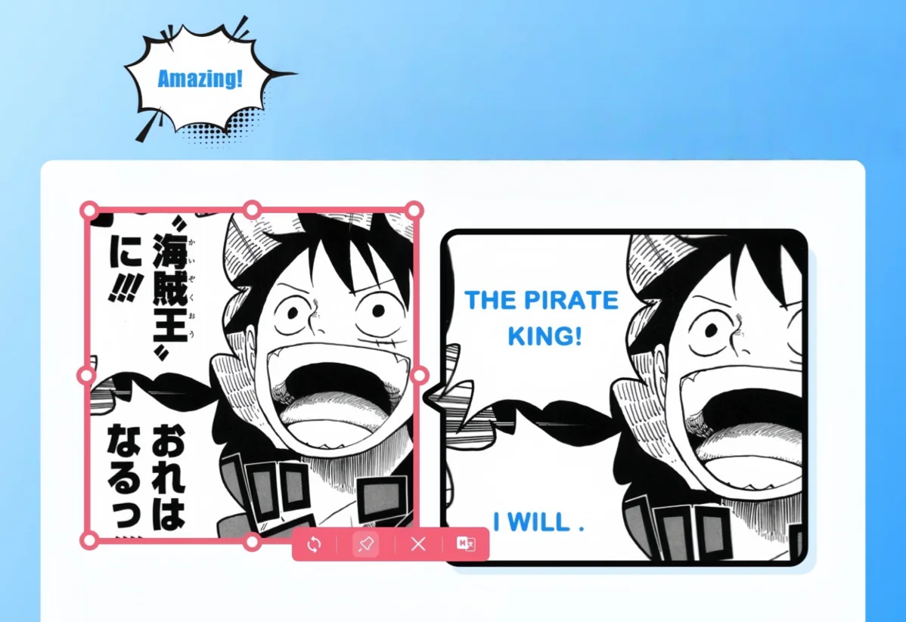
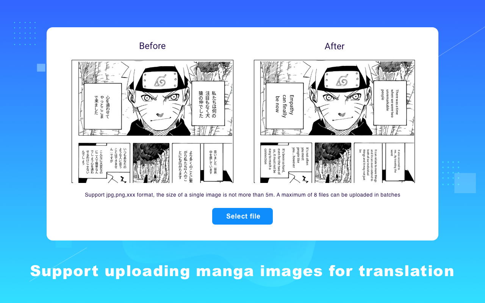
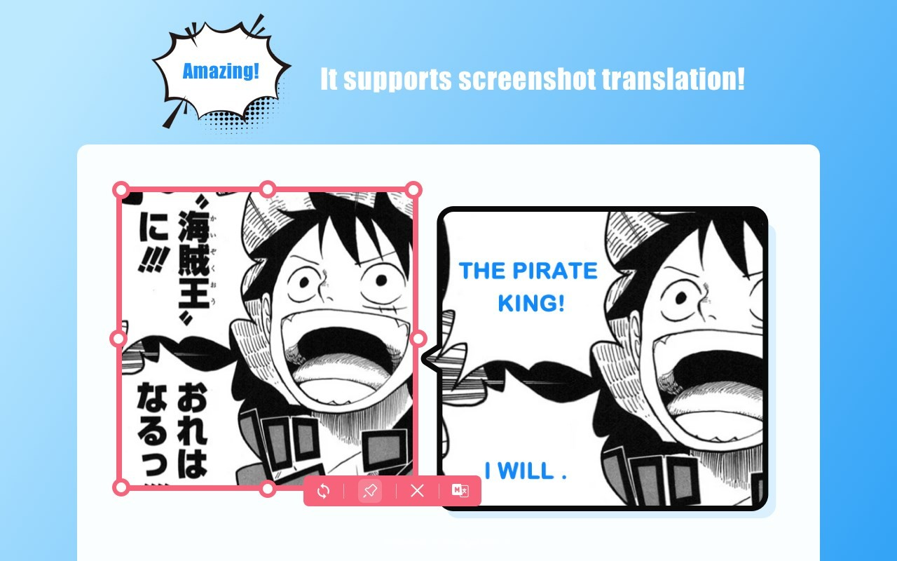

# translateManga 漫畫翻譯器 - 用戶指南

*語言選擇：[English](README.md) | [繁體中文](README_TC.md) | [العربية](README_AR.md) | [Magyar](README_HU.md) | [ไทย](README_TH.md) | [한국어](README_KO.md) | [Türkçe](README_TR.md) | [Polski](README_PL.md) | [Français](README_FR.md) | [Русский](README_RU.md) | [Español](README_ES.md)*

## 📚 目錄

- [🌟 項目簡介](#項目簡介)
- [🔍 技術原理](#技術原理)
- [✨ 功能特性](#功能特性)
- [🚀 使用教程](#使用教程)
- [🌎 地區適配](#地區適配)
- [📊 案例展示](#案例展示)
- [❓ 常見問題](#常見問題)

## 🌟 項目簡介

**translateManga漫畫翻譯神器**是一款基於先進AI技術的漫畫內容翻譯工具，能夠智能識別漫畫中的文本，並提供高質量的多語言翻譯，同時完美保留原始漫畫的藝術風格和排版佈局。無論是日本漫畫、韓國漫畫還是歐美漫畫，都能輕鬆實現跨語言閱讀體驗。

官方網站：[https://translatemanga.online](https://translatemanga.online)

### 核心優勢

- **智能識別**：先進OCR技術，準確識別各種字體和排版的漫畫文字
- **精準翻譯**：基於最新大語言模型(GPT-4, Claude等)的語境感知翻譯
- **版面保持**：翻譯後文字完美融入原始氣泡和佈局
- **多語言支持**：支持100+種語言的互譯
- **批量處理**：支持整本漫畫批量翻譯

## 🔍 技術原理

### AI驅動的翻譯引擎

本工具採用最先進的神經網絡翻譯系統，不僅能夠理解單詞含義，還能捕捉上下文語境，確保翻譯結果自然流暢。系統會首先"閱讀"整部漫畫，掌握整體風格和人物特點，然後進行連貫一致的翻譯。

### OCR文字識別技術

針對漫畫特有的排版挑戰，我們開發了專門的漫畫文本檢測器(Comic Text Detector)，能夠精確識別：

- 垂直和水平排列文字
- 手寫風格字體
- 特效字體和擬聲詞
- 背景小字和註釋
- 帶裝飾的文字氣泡

識別準確率達到業界領先的99%，即使是複雜背景下的文字也能準確提取。

### 版面保持機制

翻譯後，系統會智能調整字體大小、行間距和排版，確保翻譯文本完美融入原始氣泡和佈局。關鍵技術包括：

1. **智能排版算法**：根據目標語言文本長度自動調整字體大小和行距
2. **背景修復技術**：移除原文字後智能修復背景
3. **風格匹配**：保持與原漫畫一致的字體風格和表現力

## ✨ 功能特性

### 批量翻譯

支持整本漫畫或多頁漫畫的批量處理，一次上傳多達300MB的PDF或圖片集，系統將自動處理每一頁並生成完整的翻譯版本。

### 實時翻譯

通過瀏覽器擴展，實現網頁漫畫的實時翻譯。當您瀏覽支持的漫畫網站時，擴展會自動檢測並翻譯頁面上的漫畫內容，無需下載原圖。

支持的網站包括：

- MangaDex
- MangaFire
- 漫畫人
- WebToonScan
- 等100+漫畫網站

### 多語言支持

完整支持以下語言間的互譯：

- 英語、法語、德語、西班牙語等歐洲語言
- 中文(簡體/繁體)、日語、韓語等亞洲語言
- 阿拉伯語、希伯來語等RTL文字系統
- 俄語、波蘭語等斯拉夫語系

系統會根據不同語言特性，自動調整翻譯後的文字排版和方向。

### 截圖翻譯功能

針對實體漫畫書或不支持自動翻譯的網站，我們提供了強大的截圖翻譯功能：

1. 點擊擴展中的截圖按鈕
2. 選擇需要翻譯的漫畫區域
3. 系統自動識別文字並進行翻譯
4. 翻譯結果直接顯示在原圖上

### 術語表定制

針對特定漫畫作品，可以創建專屬術語表，確保人物名稱、特殊技能名稱等專有名詞的翻譯一致性。這對於長篇連載作品或系列漫畫尤為重要。

## 🚀 使用教程

### 快速入門 - 三步翻譯漫畫

#### 步驟一：上傳漫畫

1. 訪問漫畫翻譯平台 [https://translatemanga.online](https://translatemanga.online)
2. 點擊"上傳"按鈕
3. 選擇漫畫文件(支持JPG、PNG、PDF等格式)

#### 步驟二：選擇語言和設置

1. 選擇漫畫的源語言
2. 選擇目標翻譯語言
3. 調整翻譯設置(可選)：
   - 字體風格
   - 文本識別模式
   - 術語表設置

#### 步驟三：獲取翻譯結果

1. 點擊"開始翻譯"按鈕
2. 等待翻譯處理完成(大約1-2分鐘)
3. 預覽和下載翻譯後的漫畫

### 高級使用技巧

#### 瀏覽器擴展使用

1. 訪問官方網站下載並安裝瀏覽器擴展：[https://translatemanga.online](https://translatemanga.online)
2. 支持Chrome、Firefox或Edge瀏覽器：
     
3. 在擴展設置中選擇默認翻譯語言
4. 瀏覽支持的漫畫網站時，點擊擴展圖標激活翻譯
5. 使用截圖翻譯功能翻譯任意漫畫面板

#### 批量處理大型漫畫

1. 將整本漫畫保存為PDF或打包為ZIP/CBZ文件
2. 上傳至批量處理頁面
3. 設置全局翻譯參數
4. 啟動批量翻譯，處理時間取決於頁數
5. 下載完整翻譯版本或在線閱讀

#### 閱讀進度追蹤

為了提供更完整的漫畫閱讀體驗，translateManga擴展還提供了跨平台的閱讀進度追蹤功能：

1. 啟用閱讀進度同步功能
2. 系統會記錄您在不同網站閱讀的漫畫章節
3. 在任何裝置上登錄後都能繼續上次的閱讀進度
4. 支持自定義分類和收藏夾

#### 翻譯質量優化

1. **創建術語表**：為特定漫畫添加專有名詞翻譯對照
2. **調整識別敏感度**：對於字體特殊的漫畫，可微調文本檢測參數
3. **手動編輯**：系統支持翻譯後的手動修正和潤色

## 🌎 地區適配

### 歐美市場特色功能

針對歐美漫畫讀者的閱讀習慣，translateManga提供了以下特色功能：

1. **左至右閱讀模式**：自動調整日韓漫畫的閱讀方向，適應西方閱讀習慣
2. **西方字體優化**：提供多種西方漫畫風格字體，保持翻譯後的藝術一致性
3. **俚語與文化參考本地化**：智能轉換文化特定的表達，使翻譯更貼近目標讀者

### 多平台支持

為滿足不同地區用戶的使用習慣，translateManga提供多種使用方式：

1. **網頁應用**：直接通過瀏覽器使用，無需安裝
2. **瀏覽器擴展**：支持Chrome、Firefox、Edge等主流瀏覽器
3. **移動應用**：iOS和Android平台專用應用，支持離線翻譯
4. **桌面軟件**：Windows和macOS系統的專業版軟件，提供更強大的批處理能力

### 本地化支持

針對不同地區的特殊需求，translateManga提供了以下本地化支持：

1. **界面語言**：14種主要語言的界面本地化
2. **客戶服務**：多語言客戶支持和本地化幫助文檔
3. **合規性**：遵循GDPR、CCPA等不同地區的數據保護法規

## 📊 案例展示

### 日本漫畫翻譯案例

**《SPY×FAMILY》翻譯效果**

翻譯特點：

- 保持了原作幽默感
- 角色語氣特點準確傳達
- 專業術語翻譯精準
- 擬聲詞本地化處理

### 韓國漫畫(網漫)翻譯案例

**《塔》(Tower of God)翻譯效果**

翻譯特點：

- 垂直長條排版完美保持
- 特效字體視覺效果保留
- 術語一致性維護
- 長對話氣泡佈局優化

### 歐美漫畫翻譯案例

**《復仇者聯盟》翻譯效果**

翻譯特點：

- 西式對話框佈局保持
- 擬聲詞藝術效果重現
- 英語俚語適當本地化
- 特效字體風格匹配

## ❓ 常見問題

### 翻譯準確度相關

**Q: 翻譯質量如何保證？**
A: 我們使用業界最先進的AI大模型(GPT-4o, Claude等)進行翻譯，結合漫畫特定領域訓練，大幅提升漫畫場景翻譯準確度。翻譯前系統會先"閱讀"整部漫畫以理解上下文，確保翻譯結果連貫一致。

**Q: 能否處理特殊文化梗和雙關語？**
A: 系統能識別大多數常見文化梗和雙關語，並嘗試尋找目標語言中的等效表達。對於高度特定的文化引用，系統會保留原意並在必要時添加簡短解釋。

### 技術問題

**Q: 支持哪些文件格式？**
A: 支持常見圖片格式(JPG, PNG, WEBP)、漫畫專用格式(CBR, CBZ)以及PDF和EPUB電子書格式，單文件大小上限為300MB。

**Q: 如何處理超長漫畫頁？**
A: 系統支持高達10000像素的超長條漫畫頁面，自動分段處理並保持整體排版一致性。

**Q: 翻譯後的文件如何保存？**
A: 翻譯結果可保存為原格式(如PDF保持為PDF)，也可導出為圖片集或在線閱讀鏈接，方便分享和跨設備閱讀。

# 相關鏈接

## 相關鏈接與聯繫方式

- [官方網站](https://translatemanga.online)
- **郵箱**：support@translatemanga.online
- **Discord**：[加入我們的Discord社區](https://discord.gg/translatemanga)

如有任何問題或建議，歡迎隨時聯繫我們！

---

*本文檔最後更新於2024年6月*
